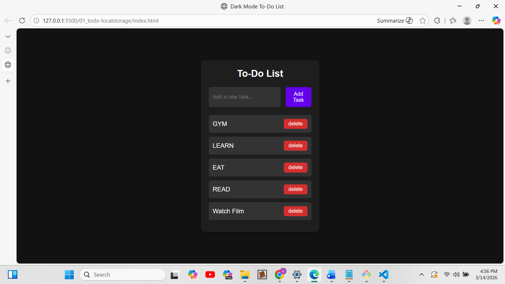

# Todo App

This is a simple Todo List application built using JavaScript.

## Features
- Add tasks
- Delete tasks
- Save tasks in localStorage

## Project Screenshot

## Important JavaScript Concepts – To‑Do App Project Notes

## 1. DOM Manipulation
DOM (Document Object Model) represents the structure of a webpage.
JavaScript uses the DOM to access and modify HTML elements.
Important methods:
document.getElementById() – Select an element using its id.
document.createElement() – Create a new HTML element.
element.innerHTML – Insert HTML inside an element.
element.appendChild() – Add an element inside another element.

## 2. Event Handling
Events allow JavaScript to respond to user actions.
Example events: click, input, submit, load.
addEventListener() is used to listen for events.
Example: button click event triggers a function.

## 3. Arrays
Arrays store multiple values in a single variable.
Example: tasks = [task1, task2, task3]
Important array methods:
push() – Add an item to the array.
forEach() – Loop through array elements.
filter() – Create a new array based on a condition.

## 4. Objects
Objects store related data in key–value pairs.
Example task object:
{ id: 123, text: 'Study JavaScript', completed: false }
Objects are commonly used to represent real-world data.

## 5. Local Storage
localStorage allows data to be stored in the browser.
Data remains even after refreshing the page.
localStorage.setItem(key, value) – Save data.
localStorage.getItem(key) – Retrieve data.

## 6. JSON
JSON (JavaScript Object Notation) is used to store structured data as strings.
JSON.stringify() – Convert object to JSON string.
JSON.parse() – Convert JSON string back to object.

## 7. Functions
Functions group reusable code.
Example in the project:
renderTask() – Creates and displays tasks in the UI.
saveTasks() – Saves tasks to localStorage.

## 8. Event Propagation Control
stopPropagation() prevents an event from bubbling up to parent elements.
Used in the delete button to prevent task toggle from triggering.

## 9. Data Flow in the To‑Do App
User enters task → Task object created.
Task added to tasks array.
Array saved in localStorage.
renderTask() updates the UI.
