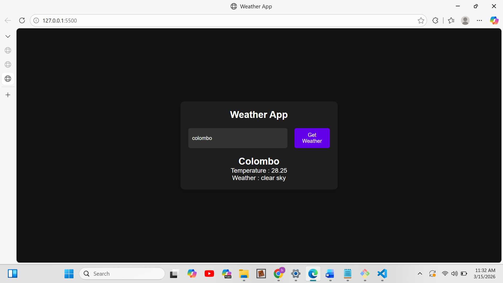

🌦 Weather App (JavaScript API Project)

A simple weather application built using JavaScript that fetches real-time weather data from the OpenWeatherMap API.
Users can enter a city name and retrieve the current temperature and weather description.

This project demonstrates API handling, asynchronous programming, and DOM manipulation in JavaScript.

## Application Workflow

User enters city name
        ↓
Clicks "Get Weather"
        ↓
JavaScript sends request to API
        ↓
API returns weather data
        ↓
Data is converted from JSON
        ↓
Weather information is displayed on the UI

## Screenshot

