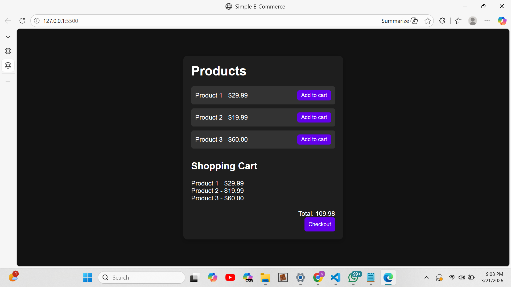

## 🛒 Shopping Cart App (JavaScript Project)

A simple shopping cart application built using JavaScript that allows users to add products to a cart and calculate the total price dynamically.

This project demonstrates array manipulation, event handling, and dynamic UI updates using JavaScript.

## 📊 Application Workflow

Products displayed
      ↓
User clicks "Add to Cart"
      ↓
Item added to cart array
      ↓
renderCart() runs
      ↓
UI updates + total calculated
      ↓
User clicks Checkout
      ↓
Cart cleared + UI reset

## Project Screenshot

